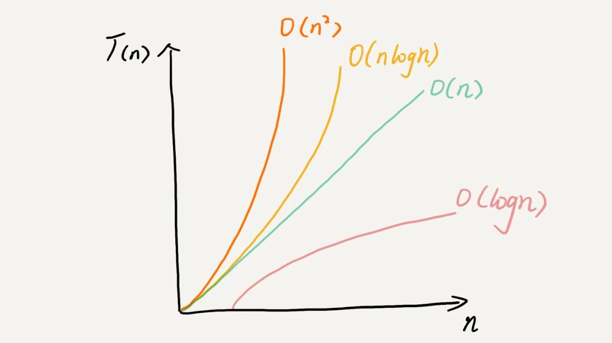

# 入门篇
>20 个最常用的、最基础数据结构与算法： 
>- 10 个数据结构：数组、链表、栈、队列、散列表、二叉树、堆、跳表、图、Trie 树。
>- 10 个算法：递归、排序、二分查找、搜索、哈希算法、贪心算法、分治算法、回溯算法、动态规划、字符串匹配算法。


### 几种常见时间复杂度实例分析


对于刚罗列的复杂度量级，我们可以粗略地分为两类，多项式量级和非多项式量级。其中，非多项式量级只有两个：O(2n) 和 O(n!)。

我们把时间复杂度为非多项式量级的算法问题叫作 **NP（Non-Deterministic Polynomial，非确定多项式）**问题。

当数据规模 n 越来越大时，非多项式量级算法的执行时间会急剧增加，求解问题的执行时间会无限增长。所以，非多项式时间复杂度的算法其实是非常低效的算法。因此，关于 NP 时间复杂度我就不展开讲了。我们主要来看几种常见的**多项式时间复杂度**。

#### 1. O(1)

首先你必须明确一个概念，O(1) 只是常量级时间复杂度的一种表示方法，并不是指只执行了一行代码。比如这段代码，即便有 3 行，它的时间复杂度也是 O(1），而不是 O(3)。

```javascript
const i = 8
const j = 6
const sum = i + j
```
我稍微总结一下，只要代码的执行时间不随 n 的增大而增长，这样代码的时间复杂度我们都记作 O(1)。
或者说，**一般情况下，只要算法中不存在循环语句、递归语句，即使有成千上万行的代码，其时间复杂度也是Ο(1)。**

#### 2. O(logn)、O(nlogn)

对数阶时间复杂度非常常见，同时也是最难分析的一种时间复杂度。我通过一个例子来说明一下。

```javascript
const i=1
while (i <= n) {
  i = i * 2
}
```

这段代码的时间复杂度就是 O(log2n)。

现在，我把代码稍微改下，你再看看，这段代码的时间复杂度是多少？

```javascript
const i=1
while (i <= n) {
  i = i * 3
}
```

这段代码的时间复杂度为 O(log3n)。
实际上，不管是以 2 为底、以 3 为底，还是以 10 为底，我们可以把所有对数阶的时间复杂度都记为 O(logn)。为什么呢？

我们知道，对数之间是可以互相转换的，log3n 就等于 log32 * log2n，所以 O(log3n) = O(C * log2n)，其中 C=log32 是一个常量。基于我们前面的一个理论：**在采用大 O 标记复杂度的时候，可以忽略系数，即 O(Cf(n)) = O(f(n))。所以，O(log2n) 就等于 O(log3n)**。因此，在对数阶时间复杂度的表示方法里，我们忽略对数的“底”，统一表示为 O(logn)。

如果你理解了我前面讲的 O(logn)，那 O(nlogn) 就很容易理解了。如果一段代码的时间复杂度是 O(logn)，我们循环执行 n 遍，时间复杂度就是 O(nlogn) 了。而且，O(nlogn) 也是一种非常常见的算法时间复杂度。比如，归并排序、快速排序的时间复杂度都是 O(nlogn)。

#### 3. O(m+n)、O(m*n)
我们再来讲一种跟前面都不一样的时间复杂度，代码的复杂度由两个数据的规模来决定。老规矩，先看代码！

```javascript
function cal(m, n) {
  const sum_1 = 0;
  const i = 1;
  for (; i < m; ++i) {
    sum_1 = sum_1 + i;
  }

  const sum_2 = 0;
  const j = 1;
  for (; j < n; ++j) {
    sum_2 = sum_2 + j;
  }

  return sum_1 + sum_2;
}
```

从代码中可以看出，m 和 n 是表示两个数据规模。我们无法事先评估 m 和 n 谁的量级大，所以我们在表示复杂度的时候，就不能简单地利用加法法则，省略掉其中一个。所以，上面代码的时间复杂度就是 O(m+n)。

针对这种情况，原来的加法法则就不正确了，我们需要将加法规则改为：T1(m) + T2(n) = O(f(m) + g(n))。但是乘法法则继续有效：T1(m)*T2(n) = O(f(m) * f(n))。



### 空间复杂度分析
时间复杂度的全称是**渐进时间复杂度，表示算法的执行时间与数据规模之间的增长关系**。类比一下，空间复杂度全称就是**渐进空间复杂度（asymptotic space complexity），表示算法的存储空间与数据规模之间的增长关系**。

``` c
void print(int n) {
  int i = 0;
  int[] a = new int[n];
  for (i; i <n; ++i) {
    a[i] = i * i;
  }

  for (i = n-1; i >= 0; --i) {
    print out a[i]
  }
}
```

### 复杂度分析
```c

// n表示数组array的长度
int find(int[] array, int n, int x) {
  int i = 0;
  int pos = -1;
  for (; i < n; ++i) {
    if (array[i] == x) {
       pos = i;
      //  break; ()
    }
  }
  return pos;
}
```

最好情况时间复杂度就是，在最理想的情况下，执行这段代码的时间复杂度。就像我们刚刚讲到的，在最理想的情况下，要查找的变量 x 正好是数组的第一个元素，这个时候对应的时间复杂度就是最好情况时间复杂度。

最坏情况时间复杂度就是，在最糟糕的情况下，执行这段代码的时间复杂度。就像刚举的那个例子，如果数组中没有要查找的变量 x，我们需要把整个数组都遍历一遍才行，所以这种最糟糕情况下对应的时间复杂度就是最坏情况时间复杂度。

平均情况时间复杂度我们都知道，最好情况时间复杂度和最坏情况时间复杂度对应的都是极端情况下的代码复杂度，发生的概率其实并不大。为了更好地表示平均情况下的复杂度，我们需要引入另一个概念：平均情况时间复杂度，后面我简称为平均时间复杂度。

均摊时间复杂度就是一种特殊的平均时间复杂度