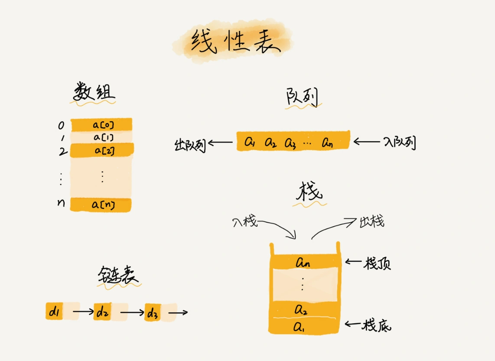

# 数组

> **数组（Array）**是一种**线性表**数据结构。它用一组连续的内存空间，来存储一组具有相同类型的数据。

### 线性表 （Linear List）
顾名思义，线性表就是数据排成像一条线一样的结构。每个线性表上的数据最多只有前和后两个方向。其实除了**数组，链表、队列、栈**等也是线性表结构。



### 非线性表
比如**二叉树、堆、图**等。之所以叫非线性，是因为，在非线性表中，数据之间并不是简单的前后关系。


### 随机访问

数组是连续的内存空间和相同类型的数据。正是因为这两个限制，它才有了一个堪称“杀手锏”的特性：“随机访问”。但有利就有弊，这两个限制也让数组的很多操作变得非常低效，比如要想在数组中删除、插入一个数据，为了保证连续性，就需要做大量的数据搬移工作。

我在面试的时候，常常会问数组和链表的区别，很多人都回答说，“**链表适合插入、删除，时间复杂度 O(1)；数组适合查找，查找时间复杂度为 O(1)**”。

实际上，这种表述是不准确的。数组是适合查找操作，但是查找的时间复杂度并不为 O(1)。即便是排好序的数组，你用二分查找，时间复杂度也是 O(logn)。所以，正确的表述应该是，**数组支持随机访问，根据下标随机访问的时间复杂度为 O(1)**。

### 低效的“插入”和“删除”

### 总结

为什么大多数编程语言中，数组要从 0 开始编号，而不是从 1 开始呢？
从数组存储的内存模型上来看，“下标”最确切的定义应该是“偏移（offset）”如果用 a 来表示数组的首地址，a[0]就是偏移为 0 的位置，也就是首地址，a[k]就表示偏移 k 个 type_size 的位置，所以计算 a[k]的内存地址只需要用这个公式：

```
a[k]_address = base_address + k * type_size
```
但是，如果数组从 1 开始计数，那我们计算数组元素 a[k]的内存地址就会变为：

```
a[k]_address = base_address + (k-1)*type_size
```

对比两个公式，我们不难发现，从 1 开始编号，每次随机访问数组元素都多了一次减法运算，对于 CPU 来说，就是多了一次减法指令。